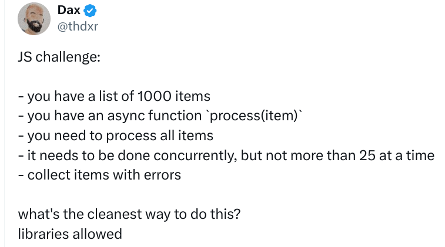
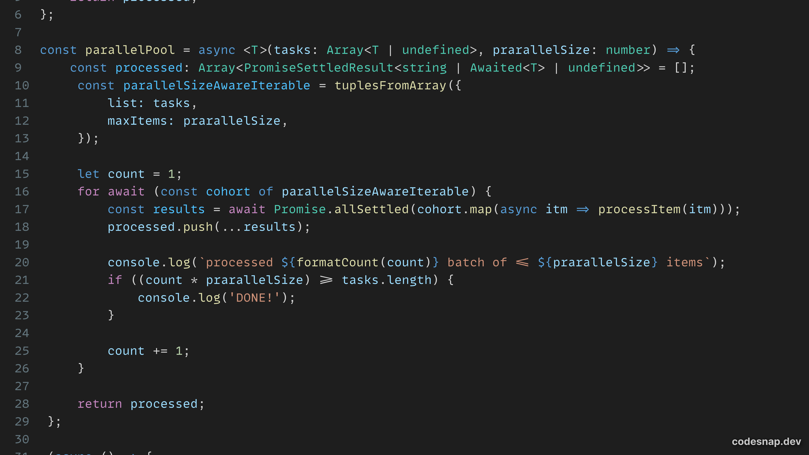

# n-tuple-array

Get a specified amount of items when iterating over a JavaScript array, instead of the single item that arrays provide per iteration, by default.


## Motivation

Imagine that you received a collection of coordinates (latitude and longitude), but they were sent 
as a flat array of values to speed up the data transfers.

`n-tuple-array` can help you get out the coordinates in pairs (their logical representation), such that you'd go **from** 
```json
// flatCoords
["5.7225", "-9.6273", "2.68452", "-30.9501", ...]
```

**to**
```javascript
// generate pairs by default
const coordIterable = tuplesFromArray({ list: flatCoords });

// using for..of, get pairs as ["5.7225", "-9.6273"] ...
for (const pair of coordIterable) {
    console.log(pair);
}

// OR manipulate pairs with regular array functions
const coordPairs = Array.from(coordIterable);
console.log(Array.isArray(coordPairs));   // true
// prints ["5.7225", "-9.6273"] ...
coordPairs
    .map(pair => {
        return myTransform(pair);
    })
	.forEach((pair) => {
        placeOnMap(pair);
    });
```

### Some Real World Examples

#### Wole Joko

I first tried my hands on this concept when [building wole-joko](https://github.com/chalu/wole-joko/blob/dev/src/js/utils.js#L57-L92), a _live coding task_ I was asked to do in an engineering manager interview :man_shrugging. It was a simulation of people entering an event hall to get seated, but only two could get in at a time. I later took some time to [give the project more life](https://wole-joko.netlify.app/)

#### Execute max of X tasks in parallel

JS challenge by [@thdxr on X.com](https://twitter.com/thdxr) <br>

<br> <br>

> The below was adapted for more concise terminal output

`n-tuple-array` solution. View [code here](https://github.com/chalu/n-tuple-array/blob/main/src/demo/demo-classic.ts#L6-L40)  <br>

<br> <br>

`n-tuple-array` solution demo <br>


 

## Setup & Usage

```bash
npm install @chalu/n-tuple-array
```

```javascript
const { tuplesFromArray } = require('@chalu/n-tuple-array');

// some setup
const numbers = Array.from({length: 100}, (_, i) => i + 1);
const isEven = (item) => {
    if (
        !item
        || typeof item !== 'number'
        || item % 2 !== 0
    ) return false;

    return true;
};

// use the lib
const quintetIterator = tuplesFromArray({
    list: numbers, maxItems: 5, match: isEven
});

for (const quintet of quintetIterator) {
    // prints [ 2, 4, 6, 8, 10 ] ... [ 92, 94, 96, 98, 100 ]
	console.log(quintet);
}
```

See more examples in [src/demo](./src/demo/) 

